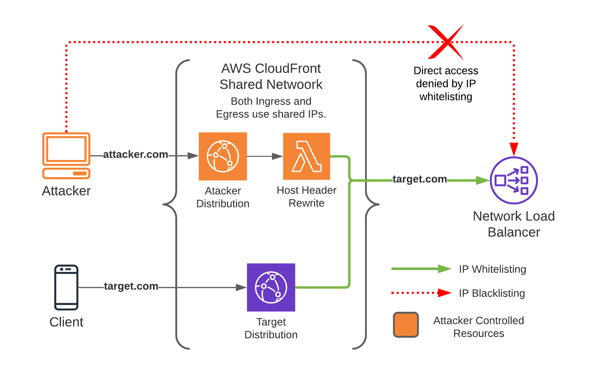

# CDN Proxy

This tool can be used by web app pentesters to create a copy of the targeted website with CDN and WAF restrictions
disabled.

## Table of Contents

- [Overview](#overview)
- [Prerequisites](#prerequisites)
- [Installation](#installation)
- [Usage](#usage)
- [Support](#support)
- [Contributing](#contributing)


## Overview

If an attacker has the origin IP of an application they may be able to bypass the CDN by making requests to the IP
itself, side stepping any protections that the CDN provides. A common response to this is to IP whitelist the CDN range
on the origin server, preventing these type of CDN bypasses.

This fix however is incomplete, it can be bypassed by setting up a second account on the CDN routing requests to the
same origin. Security protections on this second account can be disabled, sidestepping any protections on the real
account in a similar way to the original issue.



## Prerequisites

* CloudFlare or CloudFront is used to filter or restrict traffic.
  * This likely applies to other CDNs as well, this is just what is supported currently.
* You know the origin IP (the one behind the CDN).
* IP whitelisting is used to restrict access to the origin.
  * If you can access the origin directly this tool isn't needed.

Additionally, in the case of CloudFlare, the origin web app uses a default virtual host to serve the website, or you
have access to an enterprise CloudFlare account.

## Installation

Currently, you can use pip to install directly from this repo.

```sh
python3 -m venv venv
pip3 install git+ssh://git@github.com/RhinoSecurityLabs/cdn-proxy.git
cdn-proxy --help
```

## Usage

The structure for cdn-proxy commands is `cdn-proxy [provider] [action] ...` where:

Provider is:
* `cloudfront`
* `cloudflare`
  
Action is:
* `create <target>`
* `delete <target>` 
* `list` 

The process and required options is different between providers, refer to the provider sections below for more details.

### CloudFront

#### Overview

The CloudFront module will set up the distribution for you as well as correctly set the Host header as the request
passes through the CDN. The X-Forwarded-For header in the request to the origin is randomized for all requests. This
will allow bypassing app side IP based rate limiting in some cases.

#### Caveats

For the CloudFront module the target must be a hostname, this is a restriction in CloudFront on origin values of a
distribution. To work around this, you might want to check to see if a given IP resolves to a usable hostname through
a reverse IP DNS lookup. Worst case you can also set up your own public DNS record that resolves to the IP you want
to target.

The CloudFront module also is fairly slow and may take a while to set up and tear down.

#### Usage

```
Usage: cdn_proxy cloudfront [OPTIONS] COMMAND [ARGS]...

  Manage CloudFront distributions

Options:
  --region REGION    Sets the AWS region.  [default: us-east-1]
  --profile PROFILE  Shared credential profile to use.
  --help             Show this message and exit.

Commands:
  create  Create a new CloudFront distribution and Lambda@Edge function...
  delete  Disable and delete the specified distribution.
  list    List CloudFront distributions IDs and targets created with...
```

### CloudFlare

#### Overview

The CloudFlare module requires an existing zone to exist in the account already. It however is much faster to add/remove
proxies then the CloudFront module.

#### Caveats

One shortcoming of this module is that it does not set the host header to the target domain after the request passes
through the CDN. This means this module will only be effective on origins that have a default virtual host set up
hosting the website you're targeting.

You can work around this limitation if you have an enterprise CloudFlare account. This is not handled by cdn-proxy
currently, however you can configure this manually using a transform rule in your zone configuration. If you want to
see support for this added to cdn-proxy let us know in a GitHub issue.

#### Usage

```
Usage: cdn_proxy cloudflare [OPTIONS] COMMAND [ARGS]...

  Manage CloudFlare distributions

Options:
  --token REGION      Sets the AWS region.  [required]
  --zone-name REGION  Sets the AWS region.  [required]
  --help              Show this message and exit.

Commands:
  create  Create a new CloudFront distribution and Lambda@Edge function...
  delete  Disable and delete the specified distribution.
  list    List CloudFront distributions IDs and targets created with...
```

## Support

Please [open an issue](https://github.com/RhinoSecurityLabs/cdn-proxy/issues/new) for support.

## Contributing

Please contribute using [Github Flow](https://guides.github.com/introduction/flow/). Create a branch, add commits, and
[open a pull request](https://github.com/RhinoSecurityLabs/cdn-proxy/compare/).
